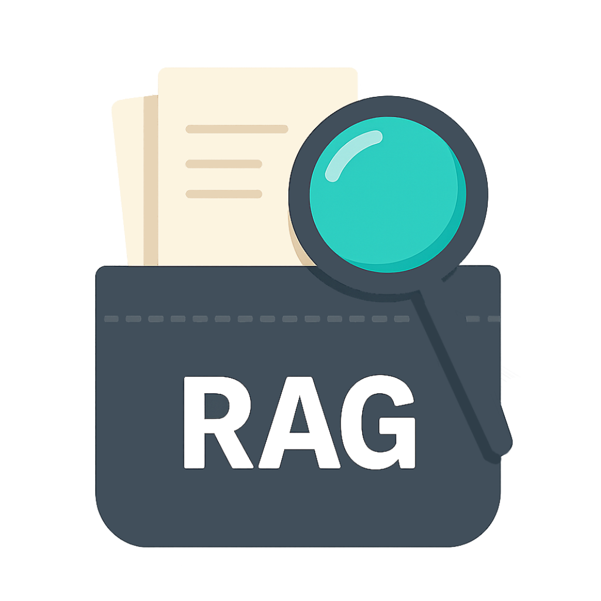

<div align="center">
  
  <h1>PocketRAG</h1>

  
  
  
  <a href="https://github.com/LKLLLLLLLLLL/PocketRAG/releases/latest">
    
  </a>
</div>

---

<!-- <h1>PocketRAG</h1> -->
PocketRAG是一个轻量的本地化RAG（检索-增强-生成）应用。不需要复杂的配置，提供直装直用的检索体验。

目前支持Windows和MacOS平台。

**CUDA支持**：该应用支持调用CUDA独显加速模型推理，如果需要使用CUDA加速，请确保系统支持CUDA 12.0及以上版本，并安装了CUDA运行时。*注意：带有CUDA加速的版本打包了`cuDNN`库，因此体积较大。*

## 快速开始

### 使用预打包版本
请从[Releases页面](https://github.com/LKLLLLLLLLLL/PocketRAG/releases/latest)选择对应操作系统的版本下载，如果需要使用CUDA加速，请下载带有`cuda`后缀的版本。

### 从源码构建

#### 环境要求

##### Windows：
- Visual Studio with C++工具链
- CMake
- Ninja
- Node.js

为了使用MSVC工具链，请确保在**Visual Studio Developer PowerShell**中执行以下操作。

##### MacOS：
- llvm/clang++编译器
- CMake
- Ninja
- Node.js

为了启用OpenMP支持，请确保已通过homebrew安装llvm/clang编译器。

#### 具体步骤

1. 克隆仓库
    ```shell
    git clone https://github.com/LKLLLLLLLLLL/PocketRAG
    cd PocketRAG
    ```

2. 获取依赖

    ```shell
    npm install
    git submodule update --init --recursive
    ```

3. 通过vcpkg编译依赖：

    ```shell
    ./vcpkg/bootstrap-vcpkg.bat
    cd kernel
    ../vcpkg/vcpkg install
    ```

4. 执行构建脚本

    ```shell
    cd .. # 返回到项目根目录
    npm run build -- 
    ```

    **可选参数**：
    - `--cuda`：构建使用CUDA加速的版本，默认构建不使用CUDA加速。
    - `--win [target]`：为Windows指定构建的目标格式，支持`nsis`, `msi`, `portable`。默认将以全部格式打包。
    - `--mac [target]`：为Mac指定构建的目标格式，支持`dmg`, `zip`。默认将以全部格式打包。

    例如：`npm run build -- --cuda --win nsis` 将构建一个使用CUDA加速的Windows NSIS安装包。

    *注意: 由于C++内核需要在目标平台上编译，不支持跨平台构建。*

5. 构建完成后，安装包将位于`dist/`目录下。

#### Troubleshooting
关于**构建脚本**：
- 构建脚本中将自动下载预编译的`ONNX Runtime`库，如果使用CUDA加速版本，还会下载`cuDNN`库。

- 若脚本执行失败，请参考[Dependencies.md](./docs/Dependencies.md)手动安装依赖，之后再次执行构建脚本。

## 开发指南

### 环境配置
请参照[从源码构建](#从源码构建)章节执行一次构建，可以确保所有依赖都已正确安装。

### 热重载
在开发过程中，可以使用以下命令启动启动热重载服务器：
```shell
npm run dev
```

### 项目结构
- `kernel/` - C++后端核心代码
    - `src/` - 源代码文件
    - `include/` - 头文件
    - `external/` - 第三方依赖
- `electron/` 前端代码
    - `main/` - Electron主进程
    - `renderer/` - Electron渲染进程与界面
    - `public/` - 静态资源
- `docs/` - 文档
- `scripts/` - 构建和开发脚本

## 常见问题

### 为何搜索结果总是为空？
搜索结果依赖于嵌入，如果没有正确配置嵌入，可能会导致搜索结果为空。请在设置界面正确导入模型，并设置嵌入配置信息。

### 支持哪些模型？
一般而言，只要是ONNX格式的模型都可以使用。目前已经测试过以下模型：
- `BGE-m3`：适用于中文和英文的嵌入模型
- `BGE-reranker-v2-m3`：适用于中文和英文的重排序模型

### 为何无法使用CUDA加速？
使用CUDA加速需要确保以下几点：
- 系统是Windows平台
- 正确安装Nvidia驱动，并且CUDA版本为12.0或以上
- 系统已安装CUDA运行时
- 下载了支持CUDA加速的PocketRAG版本，或者在构建时使用了`--cuda`参数。

## 许可证

本项目基于 [Apache License 2.0](LICENSE) 许可证开源。

使用CUDA加速版本时包含NVIDIA cuDNN库，该组件受NVIDIA软件许可协议约束。